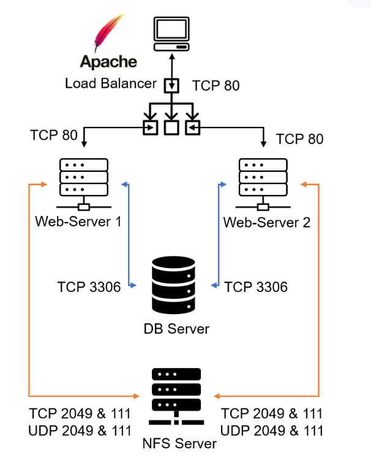
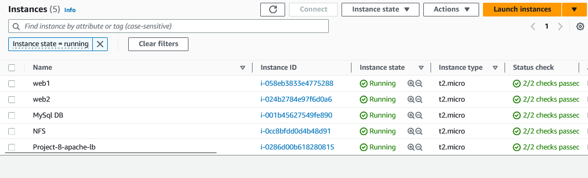
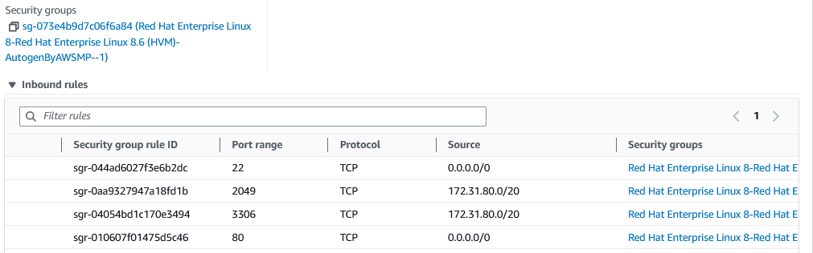
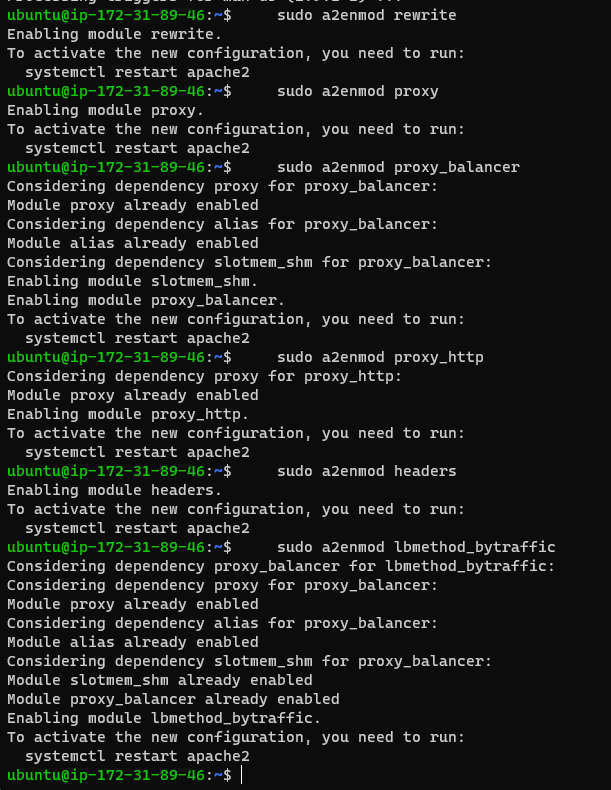
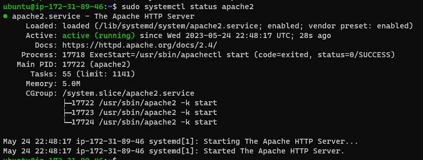
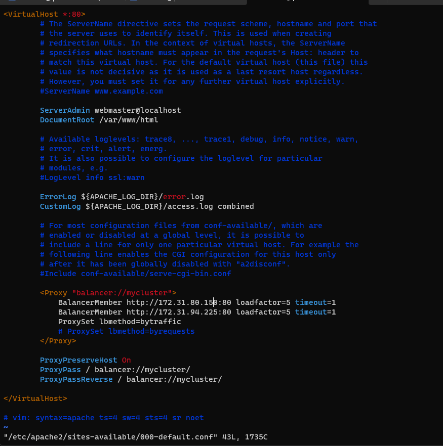
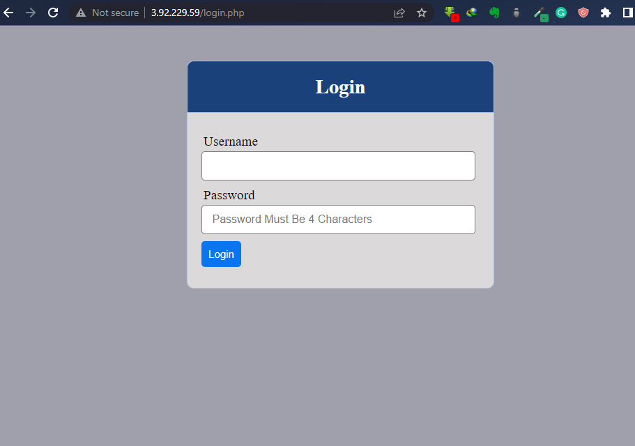
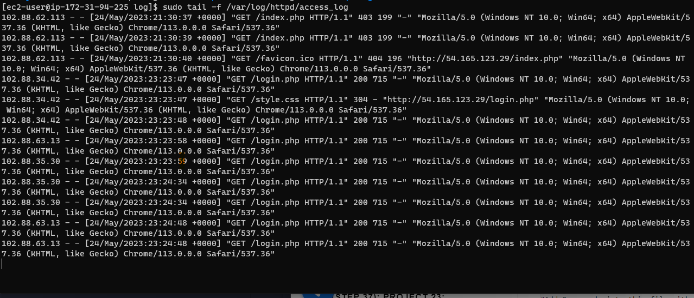
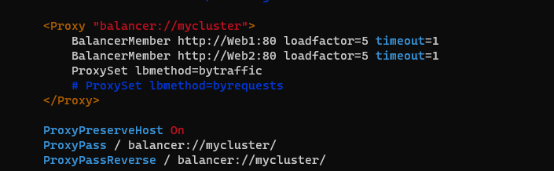
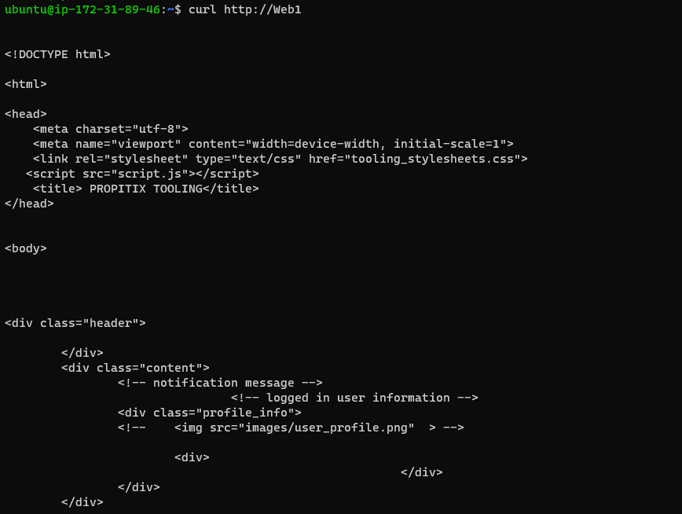

## Project 8 - Implementing a Load Balancing Solution with Apache

> NOTES: 

    When a website is opened on the internet, the URL includes a domain name section that is translated into an IP address for the target server that will handle the requests.
---
    Translation of domain names is performed by DNS servers,
---
    The most common dns server is google with a public ip address of 8.8.8.8.
    You can query it with the nslooup command

> Vertical scaling

    Vertical scaling refers to increasing the resources, such as CPU, memory, or storage, of a single machine or server to improve its performance or capacity.

    When you have just one web server and load increases, 

    you want to serve more and more customers, you can add more CPU and RAM or completely replace the server with a more powerful one – 
    
    this is called "vertical scaling". 
    
    Note: This approach has limitations – at some point you reach the maximum capacity of CPU and RAM that can be installed into your server.

> Horizontal scaling

    Another apporach used to cater for increased traffic is "horizontal scaling", ditributing load across multiple web servers. 

    Horizontal scaling refers to increasing the number of machines or servers in a system, rather than adding more resources to a single machine.
    
    In order to improve its performance or capacity. This is typically achieved by distributing the workload across multiple machines or servers, which can work together to handle the increased traffic or demand.

    Horizontal scaling allows to adapt to current load by adding (scale out) or removing (scale in) Web servers. 
    Adjustment of number of servers can be done manually or automatically (for example, based on some monitored metrics like CPU and Memory load).

> Scalablity

    Property of a system (in our case it is Web tier) to be able to handle growing load by adding resources, is called "Scalability".

    scalability refers to the ability of a server or a cluster of servers to handle an increasing number of requests, users or workloads without a decrease in performance or reliability. This can be achieved through techniques such as vertical scaling, adding more resources like CPU, memory or storage to a single server, or horizontal scaling, adding more servers to a cluster to distribute the workload.

> Load Balancer

     Load Balancer (LB) distributes clients’ requests among underlying Web Servers and makes sure that the load is distributed in an optimal way.
---

__Load balancer concept__

    Hardware load balancers and software load balancers are two types of load balancing solutions that differ in their implementation and deployment models.

    Hardware load balancers are physical devices that are purpose-built to perform load balancing functions. They typically consist of specialized hardware components such as processors, network interfaces, and memory, and are optimized for high throughput and low latency. Hardware load balancers are typically more expensive than software load balancers and are designed to handle large volumes of traffic and provide advanced features such as SSL offloading and traffic shaping.

    Software load balancers, on the other hand, are applications that run on general-purpose servers or virtual machines. They can be deployed on commodity hardware and can run on a wide range of platforms, including cloud environments. Software load balancers are typically less expensive than hardware load balancers and offer more flexibility in terms of configuration and customization. They can also be easily scaled up or down based on demand and provide features such as SSL termination, content-based routing, and session persistence.

    Both hardware and software load balancers have their own advantages and disadvantages, and the choice between the two depends on factors such as the specific use case, the scale of the deployment, the budget, and the performance requirements. In general, hardware load balancers are better suited for high-performance and high-availability applications that require low latency and high throughput, while software load balancers are better suited for smaller deployments and applications that require more flexibility and customization options.

__Difference between layer 4 and layer 4 load balancers__

    The main difference between a Layer 4 (L4) load balancer and a Layer 7 (L7) load balancer is the level at which they operate in the OSI networking model.
---
    A Layer 4 load balancer operates at the transport layer of the OSI model, which means it can distribute traffic based on IP address, port number, and protocol type. It can only see and manipulate the network packets up to the transport layer, but not the application layer. A Layer 4 load balancer is useful for handling large volumes of traffic and for load balancing across a pool of servers.
---
    On the other hand, a Layer 7 load balancer operates at the application layer of the OSI model, which means it can distribute traffic based on more detailed information about the content of the packets, such as HTTP headers and cookies. This allows for more intelligent and granular routing decisions, such as sending requests to servers based on the type of content requested, the location of the user, or other parameters. A Layer 7 load balancer is useful for handling complex applications and optimizing traffic for specific use cases.
---
    L7 load balancers offer more advanced features and capabilities for application-level load balancing.

# Labs

##  Configure Apache As A Load Balancer

> Create an Ubuntu Server 20.04 EC2 instance and name it Project-8-apache-lb, so your EC2 list will look like this:

> Open TCP port 80 on Project-8-apache-lb by creating an Inbound Rule in Security Group.

> Install Apache Load Balancer on Project-8-apache-lb server and configure it to point traffic coming to LB to both Web Servers:

    #Install apache2
    sudo apt update
    sudo apt install apache2 -y
    sudo apt-get install libxml2-dev
---
    #Enable following modules:
    sudo a2enmod rewrite
    sudo a2enmod proxy
    sudo a2enmod proxy_balancer
    sudo a2enmod proxy_http
    sudo a2enmod headers
    sudo a2enmod lbmethod_bytraffic

---
    #Restart apache2 service
    sudo systemctl restart apache2

> Verify apache2 is up and running

    sudo systemctl status apache2

> Configure load balancing

    sudo vi /etc/apache2/sites-available/000-default.conf

---
    #Add this configuration into this section <VirtualHost *:80>  </VirtualHost>
---

    <Proxy "balancer://mycluster">
            BalancerMember http://<WebServer1-Private-IP-Address>:80 loadfactor=5 timeout=1
            BalancerMember http://<WebServer2-Private-IP-Address>:80 loadfactor=5 timeout=1
            ProxySet lbmethod=bytraffic
            # ProxySet lbmethod=byrequests
    </Proxy>

        ProxyPreserveHost On
        ProxyPass / balancer://mycluster/
        ProxyPassReverse / balancer://mycluster/

---
    #Restart apache server
    sudo systemctl restart apache2

> Verify that our configuration works – try to access your LB’s public IP address or Public DNS name from your browser:

    http://<Load-Balancer-Public-IP-Address-or-Public-DNS-Name>/index.php

> Note: If in the Project-7 you mounted /var/log/httpd/ from your Web Servers to the NFS server – unmount them and make sure that each Web Server has its own log directory.

    sudo umount /var/log/httpd/

> Open two ssh/Putty consoles for both Web Servers and run following command:   

    sudo tail -f /var/log/httpd/access_log

## Optional Step - Configure Local DNS Names Resolution

> Navigate to /etc/hosts

    sudo vi /etc/hosts

> Add 2 records into this file with Local IP address adn arbitrary name for both of the Web Servers

